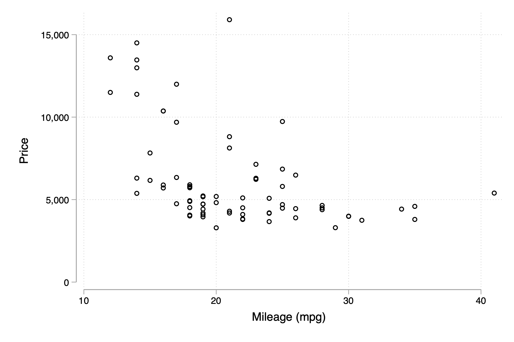
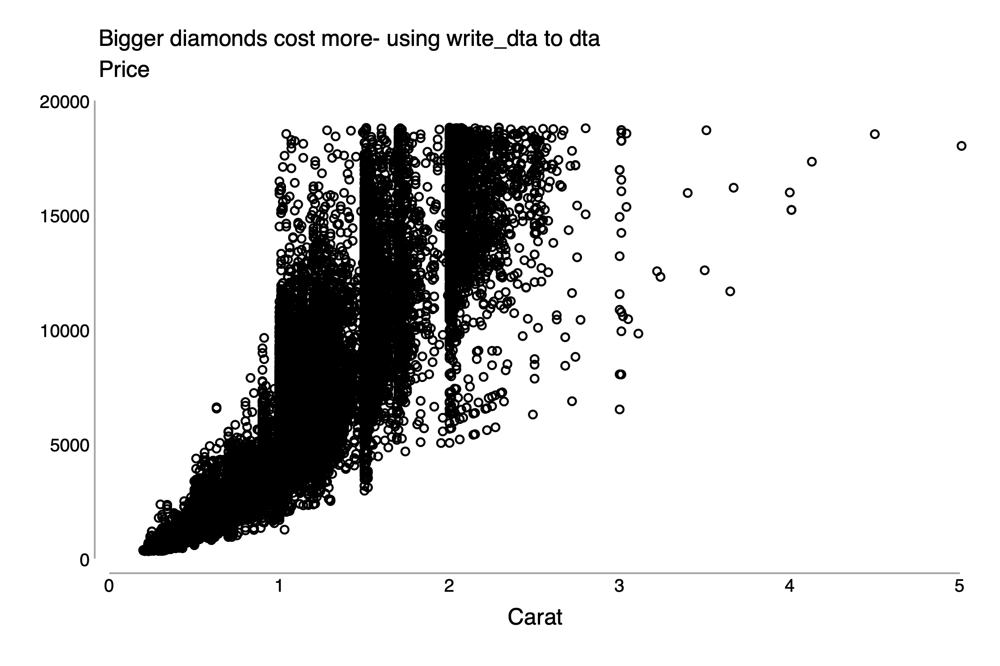

```{r setup, include=FALSE}
knitr::opts_chunk$set(echo = TRUE, cache = TRUE, dpi=300)
```

## Prologue: R Markdown 

### What is R Markdown?

Traditional `.R` scripts (analogous to a `.do` file in Stata) are a standard way to write pure R code. You could create a new R script yourself now by clicking the "New File" icon at the top-left of your RStudio session. Seriously, go ahead and try quickly.

What you see in front of you, however, is not a plain R script. It is an [**R Markdown**](https://rmarkdown.rstudio.com/) document (file extension: `.Rmd`). This is simply a document type that allows you to combine both text --- like the sentence you are reading now --- and actual R code. It is similar to Stata's `dyndoc` and is a very convenient way to integrate text and code in a single document. Think of it like LaTeX and R had a baby, but was very easy to use (was a very good baby?). In fact, the same Rmd file can be "knitted" to multiple formats: html, pdf, rich text, etc.

We don't want to get _too_ sidetracked by the special features of R Markdown... and should emphasise that it is not the only (or even "standard") way to do analysis in R. But it is an extremely popular feature of R and is also a great way to teach a session like this. If you are interested in learning more, then the [official website](https://rmarkdown.rstudio.com/) is a great place to start.^[If you are curious about Markdown formatting on its own --- how to get **bold** text or _italics_, how to create tables or headers, etc --- then see [this handy cheatsheet](https://www.markdownguide.org/basic-syntax/).] Note further that this document is about as vanilla as it gets, but you [can get](https://rmarkdown.rstudio.com/gallery.html) extremely fancy.

### Send commands to R in R Markdown 

Behind the scenes, in the `.Rmd` document we are typing in "code-chunks" that get run by R. These code chunks are fenced in with the backticks.

For example, this is a code chunk that will evaluate the command  `sin(3)` 

````
```{r}`r ''`
sin(3)
```
````

The output of this will appear as follows:

```{r echo = FALSE}
sin(3)
```

You can also create calculations inline for example `` `r knitr::inline_expr("sin(3)")` `` will evaluate `sin(3)`. With output rendering like this `r sin(3)`.

Okay, with that bit of R Markdown prologue out of the way, let's get down to running actual R code.

## Load packages into memory 

An awful lot of work in R gets done through third-party packages that must be installed separately to "base" R. This is similar to how third-party packages in Stata can be installed from ssc. We recommend using RStudio's package installer to find and install (or update) any external packages. We'll show you how do to this in the live session, or you can take a look [here](https://raw.githack.com/uo-ec607/lectures/master/01-intro/01-Intro.html#34). But note that you can also install R packages directly from the R console, e.g.

```{r pkg_install, eval=FALSE}
install.packages(c('ggplot2', 'dplyr'))
```

A key difference between R and Stata, however, is that installed R packages must be loaded into memory if you want to use them in that session. Think of it like an app on your phone. You might have downloaded the app already, but you need to open it every time you use it. Later on we will cover how to manage packages efficiently. But right now, assuming that you have already installed them, let's load and play around with some R packages.

Here we are going to load the [`ggplot2`](https://ggplot2.tidyverse.org/) package, which is an excellent graphics package. `gg` here stands for "grammar of graphics". This is a part of the `tidyverse` suite of packages that you may have heard of. We will also load the [`dplyr`](https://dplyr.tidyverse.org/) package, which is a popular data wrangling package (and is also a part of the `tidyverse`). 

```{r load-packages}
# library(tidyverse) ## Shortcut to load both ggplot2 & dplyr (& several other packages)
library(ggplot2)
library(dplyr)
```

> **Aside:** Comments in `.R` files (or code chunks) are denoted with the `#` character. A shortcut to comment out a line (or region) in RStudio is `Ctrl + Shift + c`. This shortcut generally just works correctly for whatever language or script that you open in RStudio.^[Case in point: `.Rmd` files are Markdown files, so using a leading `#` in the text will create a heading rather than a comment. However, if we hit `Ctrl + Shift + c` then RStudio will automatically generate the correct comment syntax, namely `<!––` to start the comment and `––>` to end it.] 

## View data

Now that these pacakges are loaded into memory, we can begin to use them. In the code below, we'll explore the `diamonds` dataset that comes bundled with `ggplot2`. Much like Stata's auto dataset, many packages bundle pre-installed datasets that are useful for tutorials and debugging. 

We can look at the first five observations using the `head` command

```{r head-of-data} 
head(diamonds)
```

We can get a list of column names fairly easily too

```{r list-of-column-names}
names(diamonds)
```

> Tip: You can bring the how dataset into view (similar to Stata's browse feature) by typing `View(diamonds)`. 

Let's compute the average price by color. The next code chunk is using `dplyr` commands ("verbs") and invokes a "pipe" (the `%>%` syntax) to write cleaner code.

```{r mean-price-by-color}
## summarise(group_by(diamonds, color), mean(price))
diamonds %>% group_by(color) %>% summarise(mean(price)) 
```

Here the pipe command `%>%` will take the output from the command on the left and "pipes" it as input to the command on the right. So above we 

1. take the dataset called diamonds 
1. send it as input to the command `group_by`, which groups by the unique values in the column `color`
1. We then send this grouped data to the `summarize` command, which calculates the mean price in each group. 

Two things to note. First off, you can just move onto a new line without an error. This is neat because it allows us to write cleaner code and you don't need a delimiter or the `///` you may be used to from stata. So we can rewrite the above like this. 

```{r mean-price-by-color-cleaner}
diamonds %>% 
    group_by(color) %>% 
    summarize(mean(price)) 
```

Second, in more recent versions of R (4.1 and above), you don't need to have `dpylr` installed to pipe. You can do the same thing using `|>`. 

```{r mean-price-by-color-new-pipe}
diamonds |>
    group_by(color) |>
    summarize(mean(price)) 
```

> **Note:** In this example, `%>%` and `|>` are interchangeable, but the two are not interchangeable in all settings. See https://www.r-bloggers.com/2021/05/the-new-r-pipe/ for more details. 

#### Make summary statistics table. 

An annoying, but also powerful, feature of R is that there are 15 ways to accomplish any task. In general, limiting the number of packages you use is a good idea since you won't build dependencies on code that could become outdated as base R and other packages are updated. That being said, the power of R is the ability to use fantastic user written packages. Here we will use the `datasummary*()` family of functions from the [**`modelsummary`**](https://vincentarelbundock.github.io/modelsummary/index.html) package to make fantastic summary statistic plots. Otherwise we'd have to continue to do things like we did above, exploring the data and making summary tables on our own.

> **Aside:** In Stata, many ssc modules consist of one primary function, which shares the same name (e.g. `ivreg2`, `reghdfe`). R packages tend to have many functions, so you shouldn't expect these functions to share the exact same name as the package itself.

First, load the model summary package 
```{r load-modelsummary}
library(modelsummary)
```


Now we can use the `datasummary_skim` function. 

```{r summary-table}
datasummary_skim(diamonds)
```

But not every variable is numeric. `datasummary` has this covered with the `type = "categorical"` sub-option. 

```{r summary-table-categorical}
datasummary_skim(diamonds, type = "categorical")
```

Learn more about the `datasummary*` family of functions here: https://vincentarelbundock.github.io/modelsummary/articles/datasummary.html 


##  Graphing

Next we will use the `ggplot` function. You can learn more about any R function by typing in `?` before the function name (e.g., `?ggplot`).

- On the first line, we call the function, then clarify  the dataset we wish to use (referable to by its name, `diamonds`), the y-variable (`price`), and the x-variable (`carat`). 
- On the second line, we clarify that we want the geometry to be points

```{r ggplot-1}
ggplot(data = diamonds, aes(y = price, x = carat)) +
    geom_point() 
```

Think changing graphic features in ggplot as adding layers. You can do this by repeating all of the same code. Or by saving the above as an object then adding to that object.

For example let's add a third line where use a default theme called classic that I like. 

```{r ggplot-2}
ggplot(data = diamonds, aes(y = price, x = carat)) +
    geom_point() +
    theme_classic()
```

We can obtain the same result, by saving the above as an object and adding to it. 

```{r ggplot-3}
base_plot = ggplot(data = diamonds, aes(y = price, x = carat)) +
    geom_point()
```

You can also use the `<-` arrow instead of the `=` to the name `base_plot` 

```{r ggplot-4}
base_plot +
    theme_classic()
```

All we need to do is add this theme line `theme_classic()` to the above. 

### Deviations from simple scatter plot

It's very simple to make complex plots in R. 

We can add some transparency 

```{r ggplot-5}
ggplot(data = diamonds, aes(y = price, x = carat)) +
    geom_point(alpha = .33) +
    theme_classic()
```

Customized labels and increased size of text

```{r ggplot-6}
ggplot(data = diamonds, aes(y = price, x = carat)) +
    geom_point(alpha = .1) +
    theme_classic() + 
    theme(text = element_text(size = 18)) +
    labs(title = "Larger diamonds cost more", 
          subtitle = "Price, $",
          y = "", 
          x = "Carat")
```

Recall that the data contain information on diamond color. We can easily create small multiples of the scatter plot for each color. 

```{r ggplot-7}
ggplot(data = diamonds, aes(y = price, x = carat)) +
    geom_point(alpha = .1) +
    facet_wrap(~color) +
    theme_classic() + 
    theme(text = element_text(size = 14)) +
    labs(title = "Larger diamonds cost more by diamond color", 
          subtitle = "Price, $",
          y = "", 
          x = "Carat")
```

Similarly, we can add color (or shapes) based on diamond clarity 

```{r ggplot-8}
ggplot(data = diamonds, aes(y = price, x = carat, color = clarity)) +
    geom_point(alpha = .33) +
    facet_wrap(~color) +
    theme_classic() + 
    theme(text = element_text(size = 14)) +
    labs(title = "Larger diamonds cost more by diamond color", 
          subtitle = "Price, $",
          y = "", 
          x = "Carat")
```

It's also trivial to add a regression line to each. We will pick method `lm`, which is a simple linear regression.

```{r ggplot-9}
ggplot(data = diamonds, aes(y = price, x = carat, color = clarity)) +
    geom_point(alpha = .33) +
    facet_wrap(~color) + 
    geom_smooth(method = "lm") +
    theme_classic() + 
    theme(text = element_text(size = 14)) +
    labs(title = "Larger diamonds cost more by diamond color", 
          subtitle = "Price, $",
          y = "", 
          x = "Carat")
```

We can even remove the points below by simply removing the second line

```{r ggplot-10}
ggplot(data = diamonds, aes(y = price, x = carat, color = clarity)) +
    facet_wrap(~color) + 
    geom_smooth(method = "lm") +
    theme_classic() + 
    theme(text = element_text(size = 14)) +
    labs(title = "Larger diamonds cost more by diamond color", 
          subtitle = "Price, $",
          y = "", 
          x = "Carat")
```

We can use ggplot to create all sorts of cool graphics. See cool gallery with code here: http://r-statistics.co/Top50-Ggplot2-Visualizations-MasterList-R-Code.html

## Run regressions

To do this we can use a few different methods. We will first demonstrate using base R's `lm()` (**l**inear **m**odels) function and then with the `fixest` package.
<!-- We will use `modelsummary` and `etable` (from `fixest` package) to display the results -->

###  Base R

Regressions in R use a formula interface _a la_ `y ~ x1 + x2 + ...`. Let's see that in action via a simple OLS model using the `lm` function

```{r base-r-regression}
base_model = lm(price ~ carat, data = diamonds)
```

Two things to note:

1. We saved the resulting model as an object. If you take a look at your global Environment pane (top right window in RStudio). You should see the `base_model` object there. This reflects the fact that R can hold a multitude of objects in memory at any one time. Speaking fo which...

2. Note that we specified the dataset that we want to use in the above call, i.e. `lm(..., data = diamonds)`. Specifying the dataset is very important in R; precisely because it can hold multiple objects and datasets in memory at any one time. This is a major difference to Stata where, frames aside, we only ever hold one dataset in memory at a time.

To view detailed information about our saved regression model, I can use the generic `summary()` function.

```{r base-summary}
summary(base_model)
```

To put this in a regression table form, we can use the [`modelsummary()`](https://vincentarelbundock.github.io/modelsummary/articles/modelsummary.html) function from the aforementioned package. 

```{r base-r-display}
# library(modelsummary) ## Already loaded
modelsummary(base_model) 
```

We don't have time to go into much detail, but `modelsummary()` is extremely flexible and powerful. It also plays very well with other packages. For example, can tweak this output to look a bit better. We will use the nice `kableExtra` package to help. 

```{r load-kableExtra}
library(kableExtra) ## For adding a footnote to our table

modelsummary(
  base_model,  
  title = "Fantastic regression table", 
  stars = TRUE, 
  coef_map = c("carat" = "Carat"),
  gof_omit = "Adj|Pseudo|Log|AIC|BIC|F|R2"
  ) %>%
  add_footnote("An important note.")
```

Now we can run all sorts of other models and display them side-by-side. Let's add some controls 

```{r base-r-reg-2}
model_add_controls = lm(price ~ carat + depth + table , data = diamonds)
```

We can add this model to a list with the base model. We name each item here.

```{r base-r-model-save}
models = list(
    "Base"  = base_model, 
    "Add Controls"  = model_add_controls
    )
```

We can use the same format as earlier. 

```{r base-r-model-display-2}
modelsummary(
  models,  
  title = "Fantastic regression table", 
  stars = TRUE,
  coef_omit = c("(Intercept)"), 
  coef_rename = c("carat" = "Carat", "depth" = "Depth", "table" = "Table width"),
  gof_omit = "Adj|Pseudo|Log|AIC|BIC|F|R2"
  ) %>%
  add_footnote("An important note.")
```

#### Aside 1: Adjusting standard errors

Several R packages provide support for adjusting standard errors (SEs) at estimation time, similar to Stata's `, robust` syntax. We'll see an example of that in the next section. However, R also offers a powerful alternative: Namely "on-the-fly" SE adjustment for models that have _already_ been run. This alternative approach takes a little getting used to if you're coming from Stata. But separating estimation from inference in this way comes with some big potential upsides. 

Grant has a [blog post](https://grantmcdermott.com/better-way-adjust-SEs/) that explains this on-the-fly adjustment process in more depth. However, to very quickly illustrate using the `modelsummary()` function again, consider what happens when we feed our single `base_model` object a set of "[vcov](https://vincentarelbundock.github.io/modelsummary/articles/modelsummary.html#vcov-1)" arguments. Answer: It automatically reports the adjusted SEs for all those case without having to re-run the model again!

```{r base_model_vcov}
modelsummary(
  base_model,  
  vcov = c('iid', 'robust', 'stata', 'NeweyWest'), ## New
  title = "One model, many standard errors", 
  stars = TRUE,
  coef_map = c("carat" = "Carat"),
  gof_omit = "Adj|Pseudo|Log|AIC|BIC|F|R2"
  )
```

#### Aside 2: Coefficient plot

The final arrow in the modelsummary quiver is [`modelplot()`](https://vincentarelbundock.github.io/modelsummary/articles/modelplot.html). This accepts most of the same arguments as its `modelsummary()` companion and produces nice, ggplot2-friendly coefficient plots. Adapting our previous example:

```{r base_model_vcov_plot}
modelplot(
    base_model,  
    vcov = c(iid = 'iid', 'robust', 'stata', 'NeweyWest'), 
    coef_map = c("carat" = "Carat")
    )
```

### Using `fixest`

Next, we will use [**`fixest`**](https://lrberge.github.io/fixest/index.html) to run a regression with fixed effects. 

```{r load-fixest}
library(fixest)
```

The fixed effects are those after the `|` symbol. 

```{r fixest-model}
fe_model = feols(price ~ carat + depth + table | color + cut + clarity, data = diamonds, cluster = ~color)
```

> **Aside:** Standard errors in `fixest` use a different DoF adjustment than `reghdfe` in stata. To make it comparable, you can set se options following this link: https://lrberge.github.io/fixest/articles/standard_errors.html


We can create a similar list as earlier. 

```{r fixest-list}
models = list(
    "Base"  = base_model, 
    "Add Controls"  = model_add_controls,
    "Fixed-Effects" = fe_model
)
```

```{r fixest-display}
modelsummary(models,  
  title = "Fantastic regression table", 
  stars = TRUE,
  gof_omit = "Adj|Pseudo|Log|AIC|BIC|F|R2", 
  coef_omit = c("(Intercept)"), 
  coef_rename = c("carat" = "Carat", 
                  "Num.Obs." = "N")) %>%
  add_footnote("An important note.",
  threeparttable = TRUE)
```
See more html display options here, https://cran.r-project.org/web/packages/kableExtra/vignettes/awesome_table_in_html.html


Now we can export this to latex

```{r fixest-export}
modelsummary(
  models,  
  title = "Fantastic regression table", 
  stars = TRUE,
  gof_omit = "Adj|Pseudo|Log|AIC|BIC|F|R2", 
  coef_omit = c("(Intercept)"), 
  coef_rename = c("carat" = "Carat", 
                  "Num.Obs." = "N"), 
  output = 'output/table.tex'
  )
```

#### Table using `etable`

We can also use the `etable` function that is a part of `fixest` package. 

```{r fixest-etable-load}
models_for_etable = list(
    "Fixed-Effects" = fe_model
)
```

```{r fixest-etable-display}
etable(models_for_etable) %>%
    kbl(caption = "Fantastic regression table") %>%
    kable_styling(full_width = F)
```

> **Aside:** See this excellent blog post by Patrick Baylis on how to "fine-tune" your tables using `etable` for latex export. It's quite simple to do, but will require a bit of time perfecting it to your exact liking. While it's outside the scope of this presentation, it's some hard earned knowledge he's sharing that should make your life easier. https://www.patrickbaylis.com/blog/2021-05-30-making-tables/


## Package management

A key feature of R is that you'll need to have packages installed and load them as needed. This can be painful to keep track of across machines and especially across coauthors. In addition to simply having the package installed, making sure you have the right *version* of the package is important. 

### `pacman`

`pacman` is a fantastically named package manager, it can handle both packages on CRAN and packages stored only on places like github. The `p_load` function will include the library if you have it and install it and include it if you do not. For this code chunk I have it set to not evaluate since we previously included many of these libraries.

```{r, eval = FALSE}
if (!require("pacman")) install.packages("pacman")
pacman::p_load(
  ggplot2, dplyr, modelsummary, kableExtra, fixest, devtools
)
pacman::p_load_gh("hemken/Statamarkdown")
```

This will install `pacman` if it's not currently installed. This code also introduces us to some other coding in R. You can call a function from a package using the `::` syntax where the package name is on the left and the function name on the right. This is helpful if there are two packages that have the same function name (e.g., this happens with the `select` function sometimes).

### `renv`

`renv` helps make sure that differences in package versions won't prevent you from being able to replicate your results. Essentially it stores the exact version of each package you are using in a lock file. It makes it easy for another person (or future you) to use the exact same version of each package. It saves these in a `renv.lock` file.  Once you've installed `renv` and you've opened up a new R-project, just type `renv::init()` and you should be good to go. `renv::snapshot()` will update changes. 

You can read more about `renv` here: https://rstudio.github.io/renv/articles/renv.html

## Running stata from R

- First you'll need to make sure that you have stata on the computer you're using. 
- Second, you'll need to install `Statamarkdown`

Here you'd load the package `devtools`, this allows you to install packages from github. If you're using `pacman` the `p_load_gh` function is a great way to load these packages. Then I'll install the `Statamarkdown` package. Again, not needed if you've done this using `pacman` so I've set this code chunk to only show the code and not run it.

```{r load-devtools, eval = FALSE}
library("devtools")
install_github("hemken/Statamarkdown")
```

Load the package `Statamarkdown`, again not needed if using `pacman`.

```{r setup-stata, cache = FALSE}
library("Statamarkdown")
```

Then you just need to type this code chunk.

````
```{stata}`r ''`
sysuse auto
summarize
```
````

which will result in the following output. 

```{stata, echo = FALSE, cache = FALSE}
sysuse auto
summarize
pwd

scatter price mpg
graph export "scatter.png", replace
```

You can then put these image in the RMarkdown document. 


> **Note**: These are not default stata graph preferences. See (blindschemes)[https://ideas.repec.org/c/boc/bocode/s458251.html] with the suboption `plotplainblind` if you like these formatting. 

> **Aside**: It's possible to do this without the `Statamarkdown` package, but I struggeled to get it to work, possibly because I have Stata-MP. You can see this link for more details:  https://bookdown.org/yihui/rmarkdown-cookbook/eng-stata.html For more information on `Statamarkdown` see here: https://www.ssc.wisc.edu/~hemken/Stataworkshops/Stata%20and%20R%20Markdown/StataEnginePath.html


### Meta: Use R to call stata to call R

Say that you have an R-script called `test.R`. This test script just shows `sin(3)` and is saved in the same folder as this `.Rmd` file. 

````
```{stata}`r ''`
shell /usr/local/bin/R --vanilla <test.R
```
````

```{stata, echo = FALSE, cache = FALSE}
shell /usr/local/bin/R --vanilla <test.R
```

## Misc. tips

### Clear memory

You can remove objects at any time using the `rm()` function. For example, `rm(base_model)` will remove our simple OLS model from earlier. To completely clear your memory and remove all objects, it's [best](https://www.tidyverse.org/blog/2017/12/workflow-vs-script/) to simply restart your R session. In RStudio, go to `Session > Restart R`. (Or use the keyboard shortcut: `Ctrl + Shift + F10`.)

### Reading and writing data

- Whenever possible, I try to use the `data.table` functions `fread` and `fwrite`. These work really well for csv data.

For example, let's save the diamonds dataset so we can import it in stata for a little example later on.

```{r save-diamonds}
library(data.table)
fwrite(diamonds, file = "data/diamonds.csv")
```

`data.table` is **really** **really** good with big datasets.  Check out this walkthrough: https://cran.r-project.org/web/packages/data.table/vignettes/datatable-intro.html

```{r save-diamonds-dta}
library(haven)
haven::write_dta(diamonds, path = "data/diamonds.dta", version = 14)
```

> **Note**: Reading and writing data in other formats is really easy with the `haven` package. This can also handle, wait for it, SAS datasets really easily. 

- You can read and write excel data with `readxl` package, which is a part of the `tidyverse`


We can show that this worked by using the `Statamarkdown` package. 

```{stata, cache = FALSE}
// Use the csv file saved by fwrite in R
import delimited data/diamonds.csv, clear

twoway ///
  || scatter price carat, ///
  title("Bigger diamonds cost more- using fwrite to csv", pos(11)) ///
  subtitle("Price", pos(11)) ///
  ytitle("") ///
  xtitle("Carat") ///
  yla(,nogrid notick) ///
  xla(,nogrid notick)
  
graph export "scatter-diamonds-using-csv.png", replace

// Use the dta file saved by fwrite in R
use data/diamonds.dta, clear

twoway ///
  || scatter price carat, ///
  title("Bigger diamonds cost more- using write_dta to dta", pos(11)) ///
  subtitle("Price", pos(11)) ///
  ytitle("") ///
  xtitle("Carat") ///
  yla(,nogrid notick) ///
  xla(,nogrid notick)

graph export "scatter-diamonds-using-dta.png", replace
```

You can then put these image in the RMarkdown document. 





### Collapsing data

The `collapse` package is amazing. It's crazy fast too. `collapse` plus `data.table` make creating analyitic files from large microdata a breeze. 

### Reshaping data. 

`pivot_wider` and `pivot_longer` are both a part of the `tidyverse`. Read more about them here. https://tidyr.tidyverse.org/articles/pivot.html

