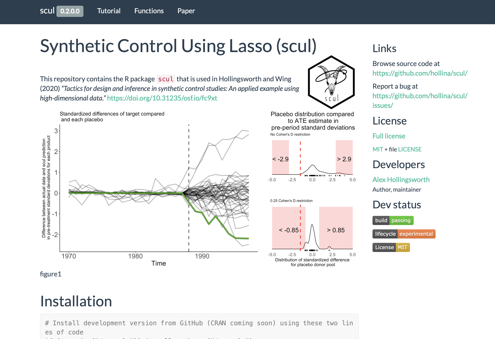

<style type="text/css">
.remark-slide-content {
    font-size: 25px;
    padding: 1em 4em 1em 4em;
}
</style>

```{r set-up, echo = FALSE, warning=FALSE, include = FALSE}
# Load packages
if (!require("pacman")) install.packages("pacman")
pacman::p_load(
  ggplot2, dplyr, modelsummary, knitr, png, pagedown
)

# Package settings
knitr::opts_chunk$set(echo = TRUE, cache = TRUE, dpi=300)

# From https://www.garrickadenbuie.com/blog/highlight-lines-without-breaking-the-code-in-xaringan/
hook_source <- knitr::knit_hooks$get('source')
knitr::knit_hooks$set(source = function(x, options) {
  x <- stringr::str_replace(x, "^[[:blank:]]?([^*].+?)[[:blank:]]*#<<[[:blank:]]*$", "*\\1")
  hook_source(x, options)
})
```

# This document was made using R-Markdown.

---
# This document was also made using R-Markdown.
.center[
```{r  out.width = "75%", echo = FALSE}
 
```
]
---
# This document was also made using R-Markdown.
.center[
```{r  out.width = "75%", echo = FALSE}
 
```
]


---
# Summary statistics table

Now we can use the `datasummary_skim` function. 

```{r summary-table}
datasummary_skim(diamonds)
```

---
# Graphing

.pull-left[
```{r ggplot-1, eval = FALSE}
ggplot(data = diamonds, aes(y = price, x = carat)) +
    geom_point() 
```
]

.pull-right[
```{r ggplot-1-out, ref.label="ggplot-1", echo=FALSE}
```
]
---
# Graphing

.pull-left[
```{r ggplot-2, eval = FALSE}
ggplot(data = diamonds, aes(y = price, x = carat)) +
    geom_point() +
    theme_classic() #<<
```
]

.pull-right[
```{r ggplot-2-out, ref.label="ggplot-2", echo=FALSE}
```
]

---
# Graphing

.pull-left[
```{r ggplot-3, eval = FALSE}
base_plot = ggplot(data = diamonds, aes(y = price, x = carat)) +
    geom_point()

base_plot + #<<
  {{theme_classic()}} #<<
```
]

.pull-right[
```{r ggplot-3-out, ref.label="ggplot-3", echo=FALSE}
```
]

---
# Graphing

.pull-left[
```{r ggplot-5, eval = FALSE}
ggplot(data = diamonds, aes(y = price, x = carat)) +
    geom_point(alpha = .1) + #<<
    theme_classic()
```
]

.pull-right[
```{r ggplot-5-out, ref.label="ggplot-5", echo=FALSE}
```
]

---
# Graphing

.pull-left[
```{r ggplot-6a, eval = FALSE}
ggplot(data = diamonds, aes(y = price, x = carat)) +
    geom_point(alpha = .1) +
    theme_classic() + 
    theme(text = element_text(size = 18)) + #<<
    labs(title = "Larger diamonds cost more", 
          subtitle = "Price, $",
          y = "", 
          x = "Carat")
```
]

.pull-right[
```{r ggplot-6a-out, ref.label="ggplot-6a", echo=FALSE}
```
]

---
# Graphing

.pull-left[
```{r ggplot-6b, eval = FALSE}
ggplot(data = diamonds, aes(y = price, x = carat)) +
    geom_point(alpha = .1) +
    theme_classic() + 
    theme(text = element_text(size = 18)) +
    labs(title = "Larger diamonds cost more", #<<
          subtitle = "Price, $", #<<
          y = "",  #<<
          x = "Carat") #<<
```
]

.pull-right[
```{r ggplot-6b-out, ref.label="ggplot-6b", echo=FALSE}
```
]

---
# Graphing

.pull-left[
```{r ggplot-7, eval = FALSE}
ggplot(data = diamonds, aes(y = price, x = carat)) +
    geom_point(alpha = .1) +
    facet_wrap(~color) + #<<
    theme_classic() + 
    theme(text = element_text(size = 18)) +
    labs(title = "Larger diamonds cost more", 
          subtitle = "Price, $", 
          y = "",  
          x = "Carat") 
```
]

.pull-right[
```{r ggplot-7-out, ref.label="ggplot-7", echo=FALSE}
```
]


---
# Graphing

.pull-left[
```{r ggplot-8, eval = FALSE}
ggplot(data = diamonds, aes(y = price, x = carat, color = clarity)) + #<<
    geom_point(alpha = .1) +
    facet_wrap(~color) +
    theme_classic() + 
    theme(text = element_text(size = 14)) +
    labs(title = "Larger diamonds cost more by diamond color", 
          subtitle = "Price, $",
          y = "", 
          x = "Carat")
```
]

.pull-right[
```{r ggplot-8-out, ref.label="ggplot-8", echo=FALSE}
```
]


---
# Graphing

.pull-left[
```{r ggplot-9, eval = FALSE}
ggplot(data = diamonds, aes(y = price, x = carat, color = clarity)) + 
    geom_point(alpha = .1) +
    facet_wrap(~color) +
    geom_smooth(method = "lm") + #<<
    theme_classic() + 
    theme(text = element_text(size = 14)) +
    labs(title = "Larger diamonds cost more by diamond color", 
          subtitle = "Price, $",
          y = "", 
          x = "Carat")
```
]

.pull-right[
```{r ggplot-9-out, ref.label="ggplot-9", echo=FALSE, message=FALSE }
```
]

---
# Graphing

.pull-left[
```{r ggplot-9b, eval = FALSE}
ggplot(data = diamonds, aes(y = price, x = carat, color = clarity)) + 
    geom_point(alpha = .1) + #<<
    facet_wrap(~color) +
    geom_smooth(method = "lm") + 
    theme_classic() + 
    theme(text = element_text(size = 14)) +
    labs(title = "Larger diamonds cost more by diamond color", 
          subtitle = "Price, $",
          y = "", 
          x = "Carat")
```
]

.pull-right[
```{r ggplot-9b-out, ref.label="ggplot-9b", echo=FALSE, message=FALSE }
```
]

---
# Graphing

.pull-left[
```{r ggplot-10, eval = FALSE}
ggplot(data = diamonds, aes(y = price, x = carat, color = clarity)) + 
    facet_wrap(~color) +
    geom_smooth(method = "lm") + 
    theme_classic() + 
    theme(text = element_text(size = 14)) +
    labs(title = "Larger diamonds cost more by diamond color", 
          subtitle = "Price, $",
          y = "", 
          x = "Carat")
```
]

.pull-right[
```{r ggplot-10-out, ref.label="ggplot-10", echo=FALSE, message=FALSE }
```
]

---
# Let's switch over to an R-Markdown document

### Also look. Some latex

$$
f(x) = \frac{1}{\sigma\sqrt{2\pi}} 
  \exp\left( -\frac{1}{2}\left(\frac{x-\mu}{\sigma}\right)^{2}\,\right)
$$
---
# And oh yea, this was made in R too.

.pull-left[

]
.pull-right[
- Check out [`rayshader`](https://www.rayshader.com) if you want to make your own awesome map, 2D, and 3D visualization. 
- Source of image: https://wcmbishop.github.io/rayshader-demo/
]
---
exclude: true

```{r, generate pdfs, include = F, eval = F}
pagedown::chrome_print("introduction-slides.html", output = "introduction-slides.pdf")
```